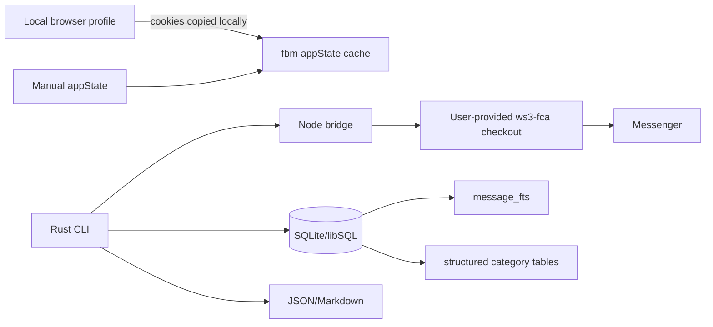

# Architecture

## Boundaries

- Rust owns CLI UX, config, browser-cookie import, storage, search, export, sync state, and structured categorization.
- Node owns runtime interaction with `ws3-fca`.
- `ws3-fca` is installed separately and loaded from `--fca-dir`.
- The local database is user data and must not be committed.

## Storage model

Core tables:

- `threads`
- `messages`
- `message_fts`
- `sync_runs`
- `thread_history_state`

Structured query layer:

- `thread_dimensions`
- `message_dimensions`
- `thread_categories`
- `message_categories`
- `category_nodes`
- `v_thread_structured`
- `v_message_structured`
- `v_category_counts`
